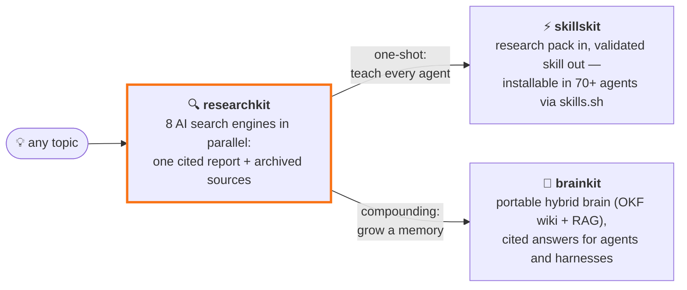

<p align="center">
  
</p>

# researchkit

> Command-line research tool (with MCP server and web UI) that fans one topic out to many AI web-search providers in parallel and merges the answers into a single citation-backed markdown report.

[](https://github.com/Paldom/researchkit/actions/workflows/ci.yml)


Every AI search provider sees a different slice of the web — and each will happily give you a confident, partial answer. researchkit asks OpenAI, Gemini, Grok, Perplexity (plus optional Tavily, Claude, GitHub, GLM) the same question at the same time, then synthesizes their findings into one report with sources you can check. One deliberate tradeoff: runs take a few minutes and spend API credits across providers — breadth over speed.



**One research run, two superpowers.** Ship the findings as an installable agent skill with [skillskit](https://github.com/Paldom/skillskit), or grow them into a portable, citation-backed brain with [brainkit](https://github.com/Paldom/brainkit).

## Quick start

Requires Python 3.11+ and [uv](https://docs.astral.sh/uv/).

```bash
git clone https://github.com/Paldom/researchkit && cd researchkit
uv sync --all-extras
cp .env.example .env    # add at least one provider API key
uv run researchkit "developer sentiment on AI coding agents" --days 7
```

Expected result: a progress log per provider, then a new `projects/<timestamp>_<topic>/` folder containing `report.md` (the cited report), `result.json`, and `run.log`. Providers without keys are skipped gracefully — one key is enough to try it.

## Use it from an AI agent (MCP)

The MCP server turns researchkit into a single `research` tool any MCP client can call:

```bash
claude mcp add researchkit -- uv run --directory /path/to/researchkit researchkit-mcp
```

or in a client config:

```json
{
  "mcpServers": {
    "researchkit": {
      "command": "uv",
      "args": ["run", "--directory", "/path/to/researchkit", "researchkit-mcp"]
    }
  }
}
```

Tools: `research(topic, days, providers, preset)` → markdown report (expect 1–5 minutes), `list_research_projects()`, `get_research_report(name)`.

## Web UI

A minimal React dashboard served by a FastAPI backend (replaces nothing you need for the CLI):

```bash
cd web && npm install && npm run build && cd ..
uv run researchkit-server
```

Open `http://127.0.0.1:8000` — submit a topic, watch live per-provider progress, read the rendered report, browse past runs. The API is documented at `/api/docs`.

The server binds `127.0.0.1` and is unauthenticated by default. To expose it beyond localhost, set `RESEARCHKIT_AUTH_TOKEN` (clients send `Authorization: Bearer <token>`) — the server refuses to bind a non-loopback host without it.

## Archive the sources (materials)

Reports cite dozens of URLs; `--materials` (or the `materials` subcommand) downloads the pages themselves — SSRF-guarded, deduplicated, politely paced — into `projects/<run>/materials/` as frontmattered markdown plus an `index.json` manifest:

```bash
uv run researchkit "your topic" --materials          # research + archive
uv run researchkit materials <project> --limit 25    # archive an earlier run
```

## Build a brain from your research

Pair researchkit with [brainkit](https://github.com/Paldom/brainkit) to turn any number of runs into a portable, citation-backed knowledge base that AI agents can query later — every answer traces back to a research run and a source URL:

```bash
# side-by-side checkouts
git clone https://github.com/Paldom/researchkit && git clone https://github.com/Paldom/brainkit
cd researchkit

uv run researchkit "your topic" --materials    # 1. research + archive cited pages

uv run --directory ../brainkit brainkit --brain ../brainkit/brain \
  ingest "$(pwd)/projects/<run-folder>"        # 2. turn the run into brain notes

uv run --directory ../brainkit brainkit --brain ../brainkit/brain \
  search "your question"                       # 3. cited answers, any time later
```

Ingest as many runs as you like into one brain — sources cited by several researches merge into single notes. In [Claude Code](https://claude.com/claude-code), both repos ship skills (`.claude/skills/`) so agents drive this pipeline and answer from the brain with citations on their own.

## Features

- Queries up to 8 AI search providers concurrently; one slow or failing provider never blocks the rest
- Cross-provider synthesis: per-provider summaries plus one consolidated, citation-backed analysis
- Recency window (`--days`) keeps results to fresh content; social and web sources are queried separately
- Project folders make every run reproducible and diffable (`config.json`, `result.json`, `report.md`, `run.log`)
- LLM council mode (`--boost`) has multiple models refine the topic, then fans hard questions out into parallel sub-investigations with a super-summary
- Model presets in [`models.yaml`](models.yaml) switch the whole pipeline between quality/cost tradeoffs (`--preset optimal` for the benchmarked cheap-and-fast setup)

## Configuration

Each provider sees a different slice of the web — that's the point of running them together. Source volumes and domain profiles below come from ~290 logged research runs and a 14-run benchmark.

| Provider   | Env var                  | Default?      | What it adds                                                                                                                                         |
| ---------- | ------------------------ | ------------- | ---------------------------------------------------------------------------------------------------------------------------------------------------- |
| OpenAI     | `OPENAI_API_KEY`         | yes           | Agentic multi-step web search with domain filtering; steady mid-volume citer (median ~50 sources/run) skewing Reddit, GitHub, arXiv, news            |
| Gemini     | `GEMINI_API_KEY`         | yes           | The only first-party Google Search grounding; near 1:1 citation-to-retrieval ratio (researchkit resolves its redirect URLs to real sources)          |
| Grok (xAI) | `XAI_API_KEY`            | yes           | Native X/Twitter search and the highest volume of any provider (median ~110 sources/run); the go-to for social pulse — X, Reddit, TikTok             |
| Perplexity | `PERPLEXITY_API_KEY`     | yes           | Search-first LLM tuned for fresh news and media; the strongest YouTube/Instagram/Facebook coverage of the API providers                              |
| Tavily     | `TAVILY_API_KEY`         | opt-in        | LLM-optimized raw search: a deterministic ~40 clean sources per run, zero failures across 149 logged runs — breadth without another model's opinions |
| Claude     | Claude Code subscription | opt-in        | Agentic multi-step research via the `claude` CLI; strongest on developer forums (Hacker News, dev.to) and the only other provider citing X           |
| GitHub     | `GITHUB_TOKEN`           | opt-in        | Developer ground truth: real repos, issues and PRs (~95% of its citations are github.com) — primary artifacts, not summaries                         |
| GLM (Z.ai) | `GLM_API_KEY`            | opt-in        | Budget generalist: cheap and reliable but capped at ~20 sources with no distinctive domains — best as an inexpensive analysis/summarizer slot        |
| Exa        | `EXA_API_KEY`            | site research | Embeddings-first neural search: finds semantically related pages that keyword search misses, with full-text retrieval for deep reading               |

All keys live in `.env` (see [`.env.example`](.env.example)). Model choices, presets, budgets, and advanced CLI-backed modes are documented in [`models.yaml`](models.yaml).

## Development

```bash
uv sync --all-extras && uv run pre-commit install
uv run ruff check . && uv run ruff format --check . && uv run mypy src && uv run pytest --cov -q
```

Agent-assisted contributions are expected here — the repo ships guardrails and conventions in [AGENTS.md](AGENTS.md).

## Contributing

Contributions welcome — see [CONTRIBUTING.md](CONTRIBUTING.md). Security reports: [SECURITY.md](SECURITY.md).

## License

MIT — see [LICENSE](LICENSE). Changes are tracked in [CHANGELOG.md](CHANGELOG.md).
