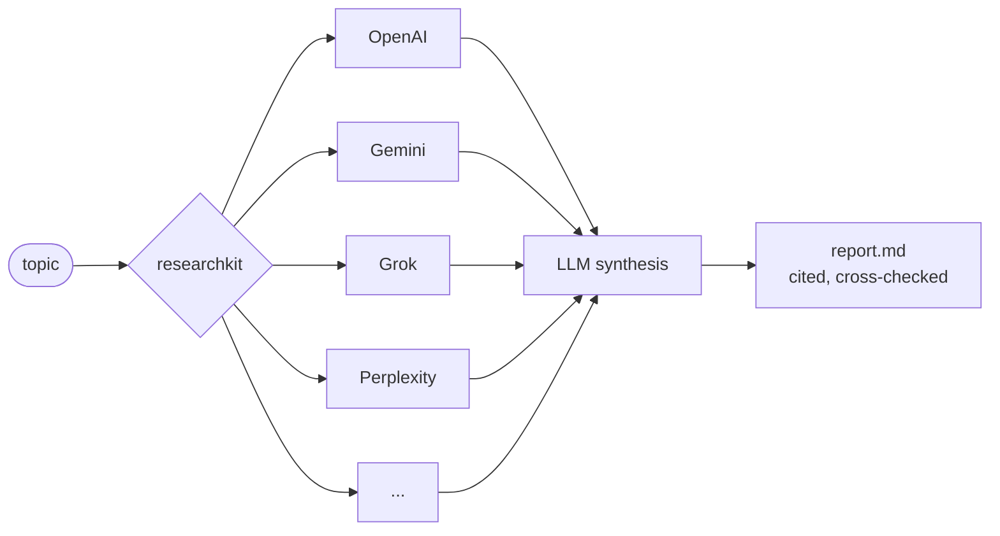

# researchkit

> Command-line research tool (with MCP server and web UI) that fans one topic out to many AI web-search providers in parallel and merges the answers into a single citation-backed markdown report.

[](https://github.com/Paldom/researchkit/actions/workflows/ci.yml)


Every AI search provider sees a different slice of the web — and each will happily give you a confident, partial answer. researchkit asks OpenAI, Gemini, Grok, Perplexity (plus optional Tavily, Claude, GitHub, GLM) the same question at the same time, then synthesizes their findings into one report with sources you can check. One deliberate tradeoff: runs take a few minutes and spend API credits across providers — breadth over speed.



## Quick start

Requires Python 3.11+ and [uv](https://docs.astral.sh/uv/).

```bash
git clone https://github.com/Paldom/researchkit && cd researchkit
uv sync --all-extras
cp .env.example .env    # add at least one provider API key
uv run researchkit "developer sentiment on AI coding agents" --days 7
```

Expected result: a progress log per provider, then a new `projects/<timestamp>_<topic>/` folder containing `report.md` (the cited report), `result.json`, and `run.log`. Providers without keys are skipped gracefully — one key is enough to try it.

## Use it from an AI agent (MCP)

The MCP server turns researchkit into a single `research` tool any MCP client can call:

```bash
claude mcp add researchkit -- uv run --directory /path/to/researchkit researchkit-mcp
```

or in a client config:

```json
{
  "mcpServers": {
    "researchkit": {
      "command": "uv",
      "args": ["run", "--directory", "/path/to/researchkit", "researchkit-mcp"]
    }
  }
}
```

Tools: `research(topic, days, providers, preset)` → markdown report (expect 1–5 minutes), `list_research_projects()`, `get_research_report(name)`.

## Web UI

A minimal React dashboard served by a FastAPI backend (replaces nothing you need for the CLI):

```bash
cd web && npm install && npm run build && cd ..
uv run researchkit-server
```

Open `http://127.0.0.1:8000` — submit a topic, watch live per-provider progress, read the rendered report, browse past runs. The API is documented at `/api/docs`.

## Features

- Queries up to 8 AI search providers concurrently; one slow or failing provider never blocks the rest
- Cross-provider synthesis: per-provider summaries plus one consolidated, citation-backed analysis
- Recency window (`--days`) keeps results to fresh content; social and web sources are queried separately
- Project folders make every run reproducible and diffable (`config.json`, `result.json`, `report.md`, `run.log`)
- LLM council mode (`--boost`) has multiple models refine the topic, then fans hard questions out into parallel sub-investigations with a super-summary
- Model presets in [`models.yaml`](models.yaml) switch the whole pipeline between quality/cost tradeoffs (`--preset optimal` for the benchmarked cheap-and-fast setup)

## Configuration

| Provider            | Env var                  | Notes                           |
| ------------------- | ------------------------ | ------------------------------- |
| OpenAI              | `OPENAI_API_KEY`         | default provider set            |
| Gemini              | `GEMINI_API_KEY`         | default provider set            |
| Grok (xAI)          | `XAI_API_KEY`            | default provider set            |
| Perplexity          | `PERPLEXITY_API_KEY`     | default provider set            |
| Tavily              | `TAVILY_API_KEY`         | opt-in via `--providers`        |
| Claude              | Claude Code subscription | opt-in; runs the `claude` CLI   |
| GitHub              | `GITHUB_TOKEN`           | opt-in; code/issue search       |
| GLM (Z.ai)          | `GLM_API_KEY`            | opt-in                          |
| Exa (site research) | `EXA_API_KEY`            | optional deep-source enrichment |

All keys live in `.env` (see [`.env.example`](.env.example)). Model choices, presets, budgets, and advanced CLI-backed modes are documented in [`models.yaml`](models.yaml). YouTube and Medium connectors are planned — the blueprint lives in [EXTRAS.md](EXTRAS.md).

## Development

```bash
uv sync --all-extras && uv run pre-commit install
uv run ruff check . && uv run ruff format --check . && uv run mypy src && uv run pytest --cov -q
```

Agent-assisted contributions are expected here — the repo ships guardrails and conventions in [AGENTS.md](AGENTS.md).

## Contributing

Contributions welcome — see [CONTRIBUTING.md](CONTRIBUTING.md). Security reports: [SECURITY.md](SECURITY.md).

## License

MIT — see [LICENSE](LICENSE). Changes are tracked in [CHANGELOG.md](CHANGELOG.md).
