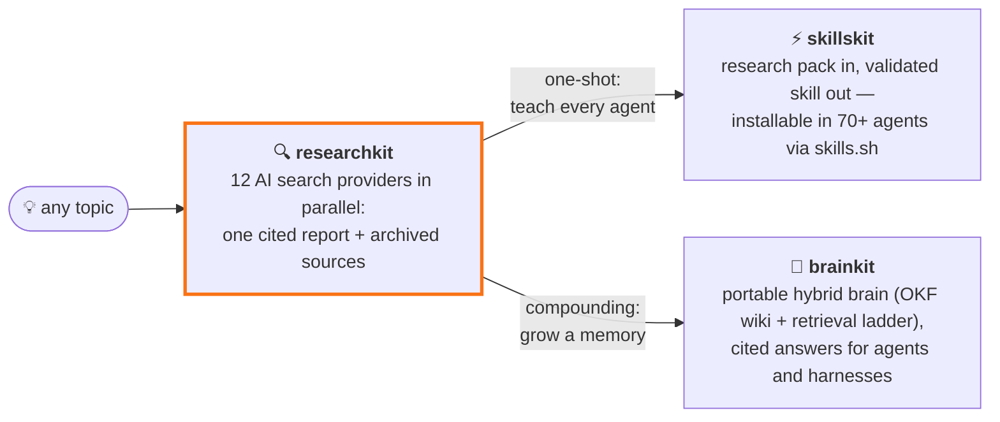

<p align="center">
  
</p>

# researchkit

> Command-line research tool (with MCP server and web UI) that fans one topic out to many AI web-search providers in parallel and merges the answers into a single citation-backed markdown report.

[](https://github.com/Paldom/researchkit/actions/workflows/ci.yml)


Every AI search provider sees a different slice of the web — and each will happily give you a confident, partial answer. researchkit asks OpenAI, Gemini, Grok, Perplexity (plus optional Tavily, Claude, GitHub, GLM, Kimi, Brave, OpenAlex, Exa) the same question at the same time, then synthesizes their findings into one report with sources you can check. One deliberate tradeoff: runs take a few minutes and spend API credits across providers — breadth over speed.



**One research run, two superpowers.** Ship the findings as an installable agent skill with [skillskit](https://github.com/Paldom/skillskit), or grow them into a portable, citation-backed brain with [brainkit](https://github.com/Paldom/brainkit).

## Quick start

Requires Python 3.11+ and [uv](https://docs.astral.sh/uv/).

```bash
git clone https://github.com/Paldom/researchkit && cd researchkit
uv sync --all-extras
cp .env.example .env    # add at least one provider API key
uv run researchkit "developer sentiment on AI coding agents" --days 7
```

Expected result: a progress log per provider, then a new `projects/<timestamp>_<topic>/` folder containing `report.md` (the cited report), `result.json`, and `run.log`. Providers without keys are skipped gracefully — one key is enough to try it.

## Use it from an AI agent (MCP)

The MCP server exposes researchkit as MCP tools any client can call:

```bash
claude mcp add researchkit -- uv run --directory /path/to/researchkit researchkit-mcp
```

or in a client config:

```json
{
  "mcpServers": {
    "researchkit": {
      "command": "uv",
      "args": ["run", "--directory", "/path/to/researchkit", "researchkit-mcp"]
    }
  }
}
```

Tools: `research(topic, days, providers, preset)` → markdown report (expect 1–5 minutes), `list_research_projects()`, `get_research_report(name)`.

## Web UI

A minimal React dashboard served by a FastAPI backend (replaces nothing you need for the CLI):

```bash
cd web && npm install && npm run build && cd ..
uv run researchkit-server
```

Open `http://127.0.0.1:8000` — submit a topic, watch live per-provider progress, read the rendered report, browse past runs. The API is documented at `/api/docs`.

The server binds `127.0.0.1` and is unauthenticated by default. To expose it beyond localhost, set `RESEARCHKIT_AUTH_TOKEN` (clients send `Authorization: Bearer <token>`) — the server refuses to bind a non-loopback host without it.

## Subscription-only mode (no API keys)

If you're logged into the coding-agent CLIs — Claude Code, Codex, Antigravity (`agy`), the Grok CLI, and Kimi Code — researchkit can run entirely on those subscriptions, with zero API keys:

```bash
uv run researchkit doctor                           # preflight: logins, model ids, keys — no tokens spent
uv run researchkit advise "is X a good idea?"       # every harness answers; you read them side by side
uv run researchkit council "is X a good idea?"      # lensed deliberation -> one boss-synthesized answer
uv run researchkit explore "your topic" --days 7    # boosted research on CLI providers only
```

| Command              | What it does                                                                                                                                                                                                                                                                                                                  | Typical time |
| -------------------- | ----------------------------------------------------------------------------------------------------------------------------------------------------------------------------------------------------------------------------------------------------------------------------------------------------------------------------- | ------------ |
| `advise "question"`  | Every harness answers the same question; you read the raw, un-synthesized comparison side by side. `--context-file notes.md` appends context.                                                                                                                                                                                 | ~20–60 s     |
| `council "question"` | Advisory deliberation: members answer through distinct lenses (practical / skeptic / tradeoffs), then a boss synthesizes one decisive answer with explicit **convergence and dissent**. `-v` appends every member's full answer.                                                                                              | ~1–2 min     |
| `explore "topic"`    | Boost-mode research on the `harness` preset: the council refines and decomposes the topic, sub-investigations run across the five CLI providers (web search included), CLI-routed summaries end to end. Supports `--days`, `--materials`, `--ingest`. The web UI has the same thing as a "Harness only (no API keys)" toggle. | ~15–30 min   |

Defaults live in the `harness` preset in [`models.yaml`](models.yaml) (`claude:claude-opus-4-8` @xhigh, `codex:gpt-5.6-sol` @xhigh, `agy:Gemini 3.5 Flash (High)`, `grokcli:grok-4.5`, `kimicli:kimi-code/k3`) — members, boss, models, and per-member `@<effort>` are all editable there, or per run via `--harnesses`/`--boss`/`--preset`. Site research stays off in these flows (its Exa connector and keyword synthesis are API-key paths). Every model spec follows the same `<harness>:<model>[@<effort>]` grammar — see the [models.yaml guide](docs/models-guide.md).

### The same commands, as Agent Skills

`advise`, `advise-max`, `council`, and `explore` also ship as [Agent Skills](https://agentskills.io) under [`.claude/skills/`](.claude/skills/), next to the existing `researchkit` pipeline skill — so an agent can drive them (`/advise`, `/advise-max`, `/council`, `/explore` in Claude Code from this repo); Codex and other Agent-Skills-standard agents discover the same skills via the repo's `.agents/skills/`. Install them into any of 70+ agents with the [skills CLI](https://skills.sh):

```bash
npx skills add Paldom/researchkit          # all detected agents
npx skills add Paldom/researchkit -a codex # or a specific agent
```

The skills wrap the CLI commands above and inherit the same guarantee: logged-in CLI subscriptions only, no API keys read.

## Archive the sources (materials)

Reports cite dozens of URLs; `--materials` (or the `materials` subcommand) downloads the pages themselves — SSRF-guarded, deduplicated, politely paced — into `projects/<run>/materials/` as frontmattered markdown plus an `index.json` manifest:

```bash
uv run researchkit "your topic" --materials               # research + archive
uv run researchkit "your topic" --materials --boost       # boosted: each sub-project archives its own sources
uv run researchkit "your topic" --materials --materials-limit 0   # lift the 25-source cap
uv run researchkit materials <project> --limit 25         # archive an earlier run
```

In boost mode the cited URLs live in the sub-projects (the parent report cites the sub-reports, not the web), so materials are archived per sub-project. When the default cap of 25 truncates a bigger citation set, the summary line says so and how to lift it. Every run prints an absolute `wrote: <path>` line, and `RESEARCHKIT_PROJECTS_DIR` pins output somewhere predictable for wrappers invoking via `uv run --directory`.

## Build a brain from your research

Pair researchkit with [brainkit](https://github.com/Paldom/brainkit) to turn any number of runs into a portable, citation-backed knowledge base that AI agents can query later — every answer traces back to a research run and a source URL:

```bash
# side-by-side checkouts
git clone https://github.com/Paldom/researchkit && git clone https://github.com/Paldom/brainkit
cd researchkit

uv run researchkit "your topic" --materials    # 1. research + archive cited pages

uv run --directory ../brainkit brainkit --brain ../brainkit/brain \
  ingest "$(pwd)/projects/<run-folder>"        # 2. turn the run into brain notes

uv run --directory ../brainkit brainkit --brain ../brainkit/brain \
  search "your question"                       # 3. cited answers, any time later
```

Or hand off in one shot: with brainkit installed into researchkit's environment (`uv pip install -e ../brainkit --python .venv/bin/python`), `--ingest <brain-dir>` runs the whole pipeline — research, archive, ingest — in a single command:

```bash
uv run --no-sync researchkit "your topic" --materials --ingest ../brainkit/brain
```

Boosted runs ingest fully too: brainkit recurses into `subprojects/`, so every sub-investigation lands as its own topic with its own cited sources. Ingest as many runs as you like into one brain — sources cited by several researches merge into single notes. In [Claude Code](https://claude.com/claude-code), both repos ship skills (`.claude/skills/`) so agents drive this pipeline and answer from the brain with citations on their own.

## Features

- Queries up to 12 AI search providers concurrently; one slow or failing provider never blocks the rest
- `researchkit doctor` preflights a preset before any spend: harness logins, pinned model ids, per-slot API keys — drift fails in seconds, not mid-run
- Every finished run is a versioned research pack ([docs/research-pack.md](docs/research-pack.md)) that brainkit ingests and skillskit skillifies; the run footer prints both next steps
- Cross-provider synthesis: per-provider summaries plus one consolidated, citation-backed analysis
- Recency window (`--days`) keeps results to fresh content; social and web sources are queried separately
- Project folders make every run reproducible and diffable (`config.json`, `result.json`, `report.md`, `run.log`)
- LLM council mode (`--boost`) has multiple models refine the topic, then fans hard questions out into parallel sub-investigations with a super-summary
- Model presets in [`models.yaml`](models.yaml) switch the whole pipeline between quality/cost tradeoffs (`--preset optimal` for the benchmarked cheap-and-fast setup)

## Configuration

Each provider sees a different slice of the web — that's the point of running them together. Source volumes and domain profiles below come from ~290 logged research runs and a 14-run benchmark.

| Provider        | Env var                              | Default?                                            | What it adds                                                                                                                                                                                                                                                                  |
| --------------- | ------------------------------------ | --------------------------------------------------- | ----------------------------------------------------------------------------------------------------------------------------------------------------------------------------------------------------------------------------------------------------------------------------- |
| OpenAI          | `OPENAI_API_KEY`                     | yes                                                 | Agentic multi-step web search with domain filtering; steady mid-volume citer (median ~50 sources/run) skewing Reddit, GitHub, arXiv, news                                                                                                                                     |
| Gemini          | `GEMINI_API_KEY`                     | yes                                                 | The only first-party Google Search grounding; near 1:1 citation-to-retrieval ratio (researchkit resolves its redirect URLs to real sources)                                                                                                                                   |
| Grok (xAI)      | `XAI_API_KEY`                        | yes                                                 | Native X/Twitter search and the highest volume of any provider (median ~110 sources/run); the go-to for social pulse — X, Reddit, TikTok. No API key? `grok: grokcli` in `models.yaml` routes it through the official Grok CLI on grok.com-subscription billing               |
| Perplexity      | `PERPLEXITY_API_KEY`                 | yes                                                 | Search-first LLM tuned for fresh news and media; the strongest YouTube/Instagram/Facebook coverage of the API providers                                                                                                                                                       |
| Tavily          | `TAVILY_API_KEY`                     | opt-in                                              | LLM-optimized raw search: a deterministic ~40 clean sources per run, zero failures across 149 logged runs — breadth without another model's opinions                                                                                                                          |
| Claude          | Claude Code subscription             | opt-in                                              | Agentic multi-step research via the `claude` CLI; strongest on developer forums (Hacker News, dev.to) and the only other provider citing X                                                                                                                                    |
| GitHub          | `GITHUB_TOKEN`                       | opt-in                                              | Developer ground truth: real repos, issues and PRs (~95% of its citations are github.com) — primary artifacts, not summaries                                                                                                                                                  |
| GLM (Z.ai)      | `GLM_API_KEY`                        | opt-in                                              | Budget generalist: cheap and reliable but capped at ~20 sources with no distinctive domains — best as an inexpensive analysis/summarizer slot                                                                                                                                 |
| Kimi (Moonshot) | `KIMI_API_KEY`                       | opt-in                                              | Moonshot's official web-search tool (Formula API) runs server-side searches mid-completion (no structured citations — sources recovered from inline links). No API key? `kimi: kimicli` in `models.yaml` routes it through the Kimi Code CLI on kimi.com-subscription billing |
| Exa             | `EXA_API_KEY`                        | opt-in via `--providers`; also powers site research | Embeddings-first neural search: finds semantically related pages that keyword search misses, with full-text retrieval for deep reading — registered both as a provider (like Tavily) and as the site-research connector                                                       |
| Brave           | `BRAVE_API_KEY`                      | opt-in via `--providers`                            | The only large independent English index (not Google/Bing-derived) plus a discussions vertical for forum/Reddit threads — catches what both big indexes miss. Sequentially paced for starter-tier rate limits; cheap tier requires public attribution                         |
| OpenAlex        | keyless (`OPENALEX_MAILTO` optional) | opt-in via `--providers`                            | Peer-reviewed literature with DOIs, venues, and citation counts. Self-gating: when the topic has no matching scholarly works it reports "not relevant" with zero sources instead of padding the report with off-topic papers                                                  |

All keys live in `.env` (see [`.env.example`](.env.example)). Model choices, presets, budgets, and advanced CLI-backed modes are documented in [`models.yaml`](models.yaml).

## Plugins

Providers and site-research connectors are **plugins**: the twelve built-in
providers (Exa doubles as the site-research connector) register through the same registry that
external plugins use, so anything you install behaves exactly like a
built-in. Activation is key-based — installing a plugin package and setting
the API key it declares is all it takes; no config ceremony:

```bash
# inside your own project (recommended): the dep lands in YOUR manifest
uv add "researchkit-plugin-example @ git+ssh://git@github.com/you/researchkit-plugin-example@v0.1.0"
echo 'EXAMPLE_API_KEY=…' >> .env
uv run researchkit plugins # → researchkit-plugin-example 0.1.0 [active]
```

`researchkit plugins` shows every installed plugin with its activation
status (`inactive (set EXAMPLE_API_KEY to activate)` when a key is
missing), version, and install origin. Every research run records the
active plugin versions in `result.json` — provenance over promises.

**Safety model, honestly:** a plugin is Python running in your process — no
sandbox; installing a package is the trust decision. researchkit adds
key-based activation (nothing runs uninvited), per-plugin quarantine (one
broken plugin can't take down a run or other plugins), API-version
handshake, name-collision rejection, and two rails:
`RESEARCHKIT_NO_PLUGINS=1` (kill switch) and
`RESEARCHKIT_PLUGINS=dist-a,dist-b` (exact allowset).

### Writing a plugin

A plugin is a normal package with one entry point returning a manifest.
Complete connector plugin, ~30 lines:

```toml
# pyproject.toml
[project]
name = "researchkit-plugin-example"
version = "0.1.0"
requires-python = ">=3.11"
dependencies = ["researchkit"]

[project.entry-points."researchkit.plugins"]
example = "researchkit_plugin_example.plugin:MANIFEST"

[build-system]
requires = ["hatchling"]
build-backend = "hatchling.build"
```

```python
# researchkit_plugin_example/plugin.py
from researchkit.plugin_api import (
    BaseSiteConnector, ConnectorContext, ConnectorSpec, PluginManifest,
    SiteItem, SiteItemSummary,
)

class ExampleConnector(BaseSiteConnector):
    site_name = "example"
    def search(self, query, published_after, limit):
        return [SiteItem(site="example", query=query, title="…", url="…",
                         content="full text here", content_kind="article")]
    def summarize(self, topic, item):
        return SiteItemSummary(tldr=["…"])
    def popularity_score(self, item):
        return 0.0

MANIFEST = PluginManifest(
    api_version=1,
    connectors=(ConnectorSpec("example", lambda ctx: ExampleConnector(),
                              requires_env=("EXAMPLE_API_KEY",)),),
)
```

Rules that keep everyone sane:

- **Import only `researchkit.plugin_api`** — everything else is private and
  will change. `ProviderSpec` works the same way for research providers
  (set `is_llm`/`supports_improver` capabilities honestly).
- **Fill `SiteItem.content` (+ `content_kind`: `article`/`transcript`/
  `summary`) when your platform's pages can't be fetched generically** —
  the materials archive stores it directly and never re-queries your API.
  Plugins hand data to core; core writes all files.
- Site research runs against **every active connector by default** —
  installing a connector plugin (plus its key) is all it takes for its
  results to appear in runs, reports, and the materials archive.
- Optional hooks: `search_batch` (replaces per-keyword search),
  `summarize_batch` (adds a digest section), `popularity_label` (report
  display like `Views: 1.2M`), `sequential = True` (hard rate limits).
- Configure per-plugin options in a preset's `plugins:` block and a model
  via a `models: {example: some-model}` key; both arrive in your factory's
  context.

### Developing against a researchkit checkout

Never `uv add` a plugin inside this repo (it would edit the committed
manifests — CI rejects it). Install editables venv-only, targeting the
project venv explicitly, and skip the pruning sync when running:

```bash
uv pip install --python .venv/bin/python -e . -e ../researchkit-plugin-example
uv run --no-sync researchkit plugins
```

(`uv run` without `--no-sync` restores the lockfile state and removes
venv-only installs; `local-plugins/` and `local-plugins.txt` are gitignored
scratch conventions for this workflow.)

## Development

```bash
uv sync --all-extras && uv run pre-commit install
uv run ruff check . && uv run ruff format --check . && uv run mypy src && uv run pytest --cov -q
```

Agent-assisted contributions are expected here — the repo ships guardrails and conventions in [AGENTS.md](AGENTS.md).

## Contributing

Contributions welcome — see [CONTRIBUTING.md](CONTRIBUTING.md). Security reports: [SECURITY.md](SECURITY.md).

## License

MIT — see [LICENSE](LICENSE). Changes are tracked in [CHANGELOG.md](CHANGELOG.md).
